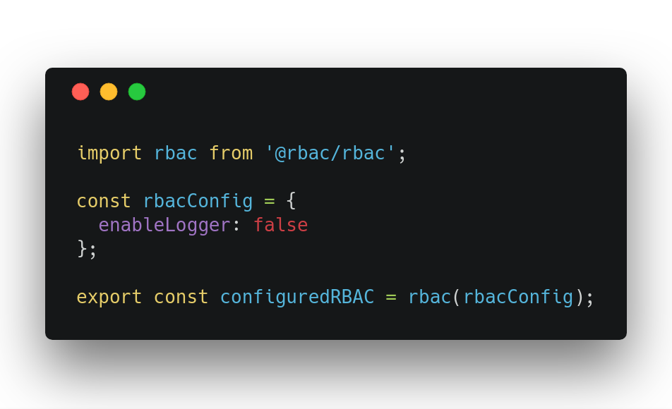
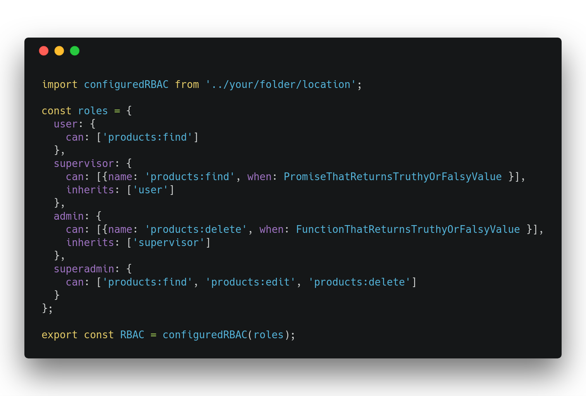
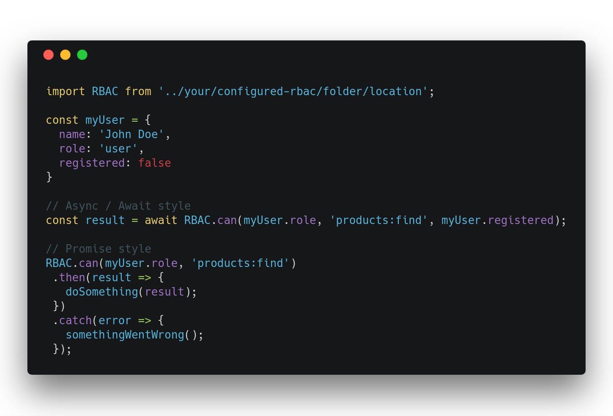

<p align="center">
  
</p>

<h1 align="center">
  Hierarchical Role-Based Access Control for Node.js
</h1>

[](https://circleci.com/gh/phellipeandrade/rbac/tree/master)
[](https://badge.fury.io/js/@rbac%2Frbac)
[](https://twitter.com/intent/tweet?text=checkout%20RBAC%20project%20on%20Github!&url=https://github.com/phellipeandrade/rbac&hashtags=rbac,authorization,privacy,security,permission)


* ⏱ Lightweight
* ⚡️Fastest RBAC (check benchmarks)
* ️🍃low dependency

## Features

* Focused on operations
* Scalable
* Each role is given specific access rights for every operation
* High granularity in assigning rights
* Wildcard and regex support for operations
* Optional database adapters (MongoDB, MySQL, PostgreSQL)
* Express, NestJS and Fastify middlewares
* Roles can be updated at runtime
* **Plugin System**: Extensible architecture with hooks and community plugins
* **Built-in Plugins**: Cache, Audit, Notification, Validation, and Middleware plugins
* **TypeScript Support**: Full type safety and IntelliSense support

## Thanks

  This project now uses **Vite** to generate the bundled output

  Thanks to Karl Düüna ([DeadAlready](https://github.com/DeadAlready)) and his awesome [post on medium](https://blog.nodeswat.com/implement-access-control-in-node-js-8567e7b484d1)
  
  
## Getting Started

#### Install

`yarn add @rbac/rbac` or `npm install @rbac/rbac`

This library is written in TypeScript and the published package ships with
its declaration files for a great developer experience.


RBAC is a curried function thats initially takes an object with configurations, 
then returns another function that takes an object with roles, 
finally returns an object that holds "can" property that is a function.

You can use it in many ways, below is one of them:

#### Setup RBAC config


| Property     	| Type          	| Params                                                      	| Default       	| Description                             	|
|--------------	|---------------	|-------------------------------------------------------------	|---------------	|-----------------------------------------	|
| logger       	| **Function**  	| role: **String**<br/>operation: **String**<br/>result: **Boolean** 	| defaultLogger 	| Function that logs operations to console 	|
| enableLogger 	| **Boolean**   	|                                                             	| true          	| Enable or disable logger                	|

#### Creating some roles


RBAC expects an object with roles as property names.

| Property 	| Type         	| Example                                        	| Description                                                                                                                                                                  	|
|----------	|--------------	|------------------------------------------------	|------------------------------------------------------------------------------------------------------------------------------------------------------------------------------	|
| can      	| **Array**    	            | ```['products:*']```                        	| Array of strings, list of operations that user can do, it also supports glob patterns                                                                                            |
| when          | **Function, Async Function or Promise**       | ```(params , done ) =>  done (null , true )``` 	| **Optional** Promise that should resolve in Truthy or Falsy, an async function that returns a boolean or Promise, or a Callback function that receives params and done as properties, should return done passing errors and result 	|
| inherits 	| **Array**    	            | ```['user']```                                 	| **Optional** Array of strings, list of roles inherited by this role                                                                                                               	|

###### IMPORTANT! **"when"** property can be a Callback function that receives params and done, an async function that returns a boolean or Promise, or a Promise that resolves in [Truthy](https://developer.mozilla.org/en-US/docs/Glossary/Truthy) or [Falsy](https://developer.mozilla.org/en-US/docs/Glossary/Falsy) values. Example: 

```ts
import type { Roles } from '@rbac/rbac';

interface Params {
  registered: boolean;
}

const roles: Roles<Params> = {
  supervisor: {
    can: [{ name: 'products:find', when: (params, done) => {
      // done receives error as first argument and Truthy or Falsy value as second argument
      done(null, params.registered);
    }}]
  },
  admin: {
    can: [{ name: 'products:*', when: async (params) => {
      return params.registered;
    } }]
  }
};

```

#### Check if user can do some operation


| Param  	| Type        	                                 | Example                  	| Description                                                    	|
|--------	|----------------------------------------------- |--------------------------	|----------------------------------------------------------------	|
| First  	| **String**  	                                 | ```'admin'```            	| Array of strings, list of operations that user can do          	|
| Second 	| **String**, **Glob (Wildcard)**, **Regex**     | ```'products:find'```    	| Operation to validate                                          	|
| Third  	| **Any**     	                                 | ```{registered: true}``` 	| **Optional** Params that will flow to "when" callback Function 	|
### Update roles at runtime

RBAC exposes two helpers to modify the role definition at runtime. `addRole` adds a new role and `updateRoles` merges new definitions with the existing ones.

```ts
import RBAC from '@rbac/rbac'

const base = RBAC({ enableLogger: false })({
  user: { can: ['products:find'] }
})

base.addRole('editor', { can: ['products:update'], inherits: ['user'] })
await base.can('editor', 'products:update') // true

base.updateRoles({
  user: { can: ['products:find', 'products:create'] }
})
await base.can('user', 'products:create') // true
```

### Database adapters

RBAC exposes optional adapters to load and persist role definitions using
MongoDB, MySQL or PostgreSQL. Each adapter implements the `RoleAdapter`
interface with `getRoles`, `addRole` and `updateRoles` methods.

```ts
import RBAC from '@rbac/rbac'
import { MongoRoleAdapter } from '@rbac/rbac/adapters'

const adapter = new MongoRoleAdapter({
  uri: 'mongodb://localhost:27017',
  dbName: 'mydb',
  collection: 'roles'
})

const roles = await adapter.getRoles()
const rbac = RBAC()(roles)
```

Adapters available:

- `MongoRoleAdapter`
- `MySQLRoleAdapter`
- `PostgresRoleAdapter`

Adapters also allow customizing the underlying table or collection column names
through a `columns` option when creating a new instance:

```ts
const adapter = new MySQLRoleAdapter({
  table: 'roles',
  columns: { name: 'rname', role: 'rdef', tenantId: 'tid' }
})
```

### Multi-tenant RBAC

Adapters can optionally receive a `tenantId` parameter to store and retrieve
roles for different tenants. When omitted, the adapter falls back to a default
tenant so existing single-tenant usage keeps working. Use `createTenantRBAC` to
instantiate an RBAC instance scoped to a tenant:

```ts
import { MongoRoleAdapter, createTenantRBAC } from '@rbac/rbac';

const adapter = new MongoRoleAdapter({ uri: 'mongodb://localhost:27017', dbName: 'mydb', collection: 'roles' });

await adapter.addRole('user', { can: ['products:find'] }, 'tenant-a');

const rbacTenantA = await createTenantRBAC(adapter, 'tenant-a');
await rbacTenantA.can('user', 'products:find'); // true
```

### Plugin System

RBAC v2.2.0 introduces a powerful plugin system that allows you to extend and customize the RBAC functionality. The plugin system provides hooks for intercepting and modifying permission checks, role updates, and other RBAC operations.

#### Key Features

- **Extensible Architecture**: Add custom functionality without modifying core RBAC code
- **Hook System**: Intercept operations at various points in the RBAC lifecycle
- **Plugin Management**: Install, configure, and manage plugins dynamically
- **Type Safety**: Full TypeScript support with comprehensive type definitions
- **Community Plugins**: Share and use community-developed plugins

#### Available Hooks

The plugin system provides several hooks that allow you to intercept and modify RBAC operations:

- `beforePermissionCheck`: Execute logic before permission validation
- `afterPermissionCheck`: Execute logic after permission validation
- `beforeRoleUpdate`: Execute logic before role updates
- `afterRoleUpdate`: Execute logic after role updates
- `beforeRoleAdd`: Execute logic before adding new roles
- `afterRoleAdd`: Execute logic after adding new roles
- `onError`: Handle errors that occur during RBAC operations
- `onStartup`: Execute logic when the plugin is initialized
- `onShutdown`: Execute logic when the plugin is uninstalled

#### Built-in Plugins

RBAC comes with several built-in plugins:

- **Cache Plugin**: Optimize permission checks with in-memory caching
- **Audit Plugin**: Track security activities and compliance events
- **Notification Plugin**: Send alerts for security events
- **Validation Plugin**: Validate roles, operations, and parameters
- **Middleware Plugin**: Express.js middleware for HTTP request handling

#### Basic Usage

```ts
import RBAC from '@rbac/rbac';
import { createCachePlugin, createAuditPlugin } from '@rbac/rbac/plugins';

// Create RBAC instance
const rbac = RBAC({ enableLogger: false })({
  user: { can: ['products:read'] },
  admin: { can: ['products:*'], inherits: ['user'] }
});

// Install plugins
await rbac.plugins.install(createCachePlugin({
  enabled: true,
  priority: 50,
  settings: {
    ttl: 300, // 5 minutes
    maxSize: 1000,
    strategy: 'lru'
  }
}));

await rbac.plugins.install(createAuditPlugin({
  enabled: true,
  priority: 30,
  settings: {
    logLevel: 'info',
    enableConsoleLogging: true
  }
}));

// Use RBAC normally - plugins work automatically
const canRead = await rbac.can('user', 'products:read');
```

#### Creating Custom Plugins

You can create custom plugins by implementing the `RBACPlugin` interface:

```ts
import { RBACPlugin, PluginContext, PluginConfig } from '@rbac/rbac/plugins';

export class MyCustomPlugin implements RBACPlugin {
  metadata = {
    name: 'my-custom-plugin',
    version: '1.0.0',
    description: 'My custom RBAC plugin',
    author: 'Your Name',
    license: 'MIT'
  };

  async install(context: PluginContext): Promise<void> {
    // Plugin initialization logic
    context.logger('My custom plugin installed', 'info');
  }

  async uninstall(): Promise<void> {
    // Plugin cleanup logic
  }

  getHooks() {
    return {
      beforePermissionCheck: this.beforePermissionCheck.bind(this),
      afterPermissionCheck: this.afterPermissionCheck.bind(this)
    };
  }

  private async beforePermissionCheck(data: any, context: PluginContext): Promise<any> {
    // Custom logic before permission check
    context.logger(`Checking permission: ${data.role} -> ${data.operation}`, 'info');
    return data;
  }

  private async afterPermissionCheck(data: any, context: PluginContext): Promise<any> {
    // Custom logic after permission check
    context.logger(`Permission result: ${data.result}`, 'info');
    return data;
  }
}
```

#### Plugin Management

```ts
// List installed plugins
const plugins = rbac.plugins.getPlugins();
console.log('Installed plugins:', plugins);

// Get specific plugin
const plugin = rbac.plugins.getPlugin('cache-plugin');
console.log('Cache plugin:', plugin);

// Update plugin configuration
await rbac.plugins.updatePluginConfig('cache-plugin', {
  enabled: true,
  priority: 80,
  settings: { ttl: 600 }
});

// Uninstall plugin
await rbac.plugins.uninstall('cache-plugin');
```

#### Community Plugins

The plugin system supports community-developed plugins. You can:

- Discover available plugins
- Install plugins from npm packages
- Validate plugin security and compatibility
- Share your own plugins with the community

```ts
import { createRBACWithAutoPlugins } from '@rbac/rbac/plugins';

// Auto-load community plugins
const rbacWithPlugins = await createRBACWithAutoPlugins(rbac, {
  autoLoadCommunityPlugins: true,
  validatePlugins: true,
  strictMode: false
});
```

Want more? Check out the [examples](examples/) folder and the [plugin documentation](src/plugins/README.md).

### Middlewares

RBAC also provides helper middlewares for **Express**, **NestJS** and **Fastify**.
They make it easy to guard routes using existing role definitions.

```ts
import RBAC, { createExpressMiddleware } from '@rbac/rbac';

const rbac = RBAC({ enableLogger: false })({
  user: { can: ['products:find'] }
});

const canFindProducts = createExpressMiddleware(rbac)('products:find');

app.get('/products', canFindProducts, handler);
```

For NestJS and Fastify you can use `createNestMiddleware` and `createFastifyMiddleware`
respectively with a similar API.

## Roadmap

- [X] Wildcard support
- [X] Regex support
- [X] Update roles in runtime
- [X] Async `when` callbacks
- [X] Database adapters (MongoDB, MySQL, PostgreSQL)
- [X] Middlewares for Express, NestJS and Fastify
- [X] Plugin system with hooks
- [X] Built-in plugins (Cache, Audit, Notification, Validation, Middleware)
- [X] Community plugin support
- [X] TypeScript support

## v2.2.0

- **Complete Internationalization**: All code, comments, and documentation translated to English
- **Enhanced Plugin System**: Improved plugin management and error handling
- **Better TypeScript Support**: Enhanced type definitions and IntelliSense
- **Improved Documentation**: Comprehensive README with plugin system documentation

## v2.1.0

- **Plugin System**: Extensible architecture with hooks and community plugins
- **Built-in Plugins**: Cache, Audit, Notification, Validation, and Middleware plugins
- **Community Plugin Support**: Share and use community-developed plugins
- **Enhanced TypeScript Support**: Full type safety and IntelliSense support

## v2.0.0

- Rewritten in TypeScript
- Internal refactor focused on readability and performance
- Added support to update roles at runtime
- Database adapters
- Middlewares for Express, NestJS and Fastify

## Benchmarks

Run `npm run bench` to execute the performance suite. The script runs two end-to-end scenarios:

- **Baseline comparison** – compares `@rbac/rbac` with AccessControl, RBAC, Easy RBAC and Fast RBAC using the default dataset.
- **Large dataset comparison** – stresses the libraries with hundreds of resources, deep inheritance chains and three `when` flavours (callback, async function and promise).

For each scenario the suite generates detailed reports (JSON/CSV/HTML chart) under `benchmarks/results/` and prints a human-readable summary (ops/sec, margins, standard deviation, samples, etc.).

```
$ npm run bench
RBAC Performance Comparison ops/sec: 6859456, 6193737, 4427263, ...
RBAC Performance Comparison - Large Dataset ops/sec: 3277352, 3396327, 3424089, ...
```

The baseline run shows @rbac/rbac leading all categories; the large dataset confirms the same behaviour when conditional checks and large permission sets come into play.

## More Information

- [Migration guide from v1 to v2](docs/migrating-v1-to-v2.md)
- [Changelog](CHANGELOG.md)

## Contributing

#### Contributions are welcome!

1. Build RBAC
  * Run `npm install` (or `yarn install`) to get RBAC's dependencies
  * Run `npm run build` to compile the library and produce the minified bundle using Vite

2. Development mode
  * Having all the dependencies installed run `yarn dev`. This command will generate a non-minified version of your library and will run a watcher so you get the compilation on file change.

3. Running the tests
  * Run `yarn test` 

4. Plugin Development
  * Check out the [plugin documentation](src/plugins/README.md) for detailed information
  * Use the [community plugin template](src/plugins/community-template.ts) as a starting point
  * Follow the [plugin development guidelines](src/plugins/COMMUNITY_PLUGINS.md)
  * Test your plugins using the provided examples and test suites

5. Scripts
* `npm run build` - produces production version of your library under the `lib` folder and generates `lib/@rbac/rbac.min.js` via Vite
* `npm run dev` - produces development version of your library and runs a watcher
* `npm test` - well ... it runs the tests :)
* `npm run test:watch` - same as above but in a watch mode
* `npm run bench` - run the benchmark suite

## License

This project is under MIT License [https://opensource.org/licenses/MIT]
